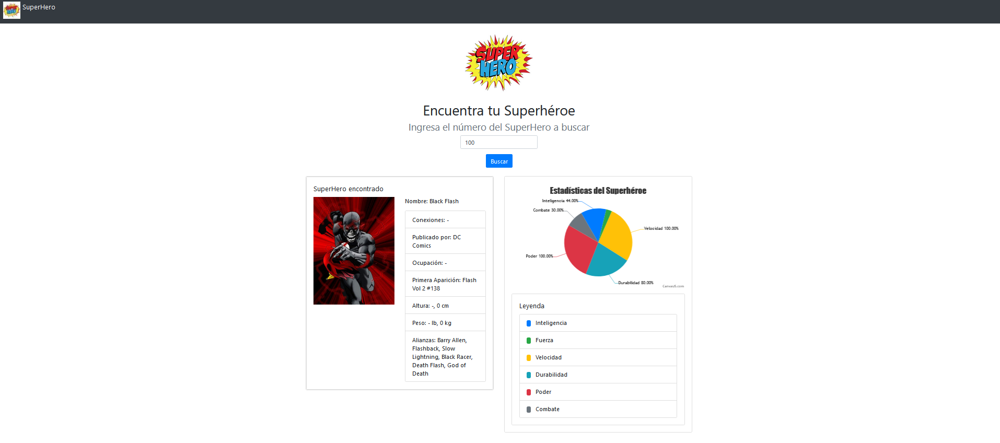

# SuperHero_SimonVelasquez
Para evaluacion

# https://github.com/siseveca79/SuperHero_SimonVelasquez

# Descargar
1. Clonar con el comando: git clone https://github.com/siseveca79/SuperHero_SimonVelasquez.git

cd SuperHero_SimonVelasquez
2. code .
3. Ya en visual estudio code, siempre debes estar en la carpeta donde esta server.js : SuperHero_SimonVelasquez>

# Paso para que funcione :

1. npm init -y
2. npm install express
3. npm install axios
4. node server.js 
5. "Servidor backend escuchando en el puerto 3000" http://127.0.0.1:3000/
6. Ingresa el número del SuperHero a buscar
7. Presionar boton "Buscar"
8. Control + C para detener servidor.

